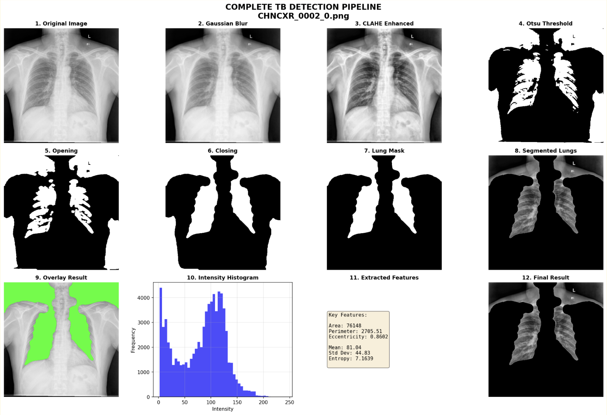

<div align="center">

# 🫁 Deteksi TBC Otomatis
**Skema Ekstraksi Fitur Hierarkis pada Citra X-Ray Dada**


<p align="center">
  <a href="#-gambaran-umum">Gambaran Umum</a> •
  <a href="#-metodologi--fitur">Metodologi</a> •
  <a href="#-hasil-eksperimen">Hasil</a> •
  <a href="#-cara-menjalankan">Instalasi</a> •
  <a href="#-struktur-direktori--lokasi-laporan">Struktur Folder</a> •
  <a href="#-demo-video">Video</a> •
  <a href="#-referensi">Referensi</a>
</p>

</div>

---

## 🏛️ Identitas Proyek
> **Final Project Mata Kuliah MII212204 - Pengolahan Citra Digital (Kelas KOM)** > Departemen Ilmu Komputer dan Elektronika, FMIPA UGM - Semester Gasal 2025.

### 👥 Kelompok 4
| NIM | Nama Anggota | 
| :--- | :--- | :--- |
| **23/521206/PA/22409** | **Salmaa Ceiba Abdillah** | 
| **24/534421/PA/22664** | **Kenji Ratanaputra** | 
| **24/540342/PA/22939** | **Ivan Zuhri Ramadhani Syahrial** | 
| **24/543855/PA/23113** | **Farsya Nabila Tori** | 

---

## 📋 Gambaran Umum
**TBScan** (nama proyek ini) adalah sistem *Computer-Aided Diagnosis* (CAD) untuk mendeteksi Tuberkulosis (TBC) dari citra Chest X-Ray (CXR).

Berbeda dengan pendekatan *Deep Learning* (CNN) yang "Black Box", proyek ini mengusung konsep **Explainable AI** dengan meniru cara kerja dokter radiologi:
1. **Analisis Bentuk:** Melihat apakah paru-paru menyusut atau berubah bentuk (efusi pleura).
2. **Analisis Tekstur:** Melihat apakah ada bercak putih/kabut (infiltrat/konsolidasi) di dalam paru.

### 🔍 Pipeline Sistem
Berikut adalah visualisasi lengkap proses dari citra mentah hingga hasil deteksi (Segmentasi Sensitif & Insensitif):


*(Gambar: Proses Preprocessing, Segmentasi, hingga Ekstraksi Fitur)*

---

## 🚀 Metodologi & Fitur

Kami mengimplementasikan **Skema Hierarkis** yang diadaptasi dari penelitian *Chandra et al. (2020)*:

### 1. Pra-pemrosesan (Preprocessing)
* **CLAHE:** Meningkatkan kontras lokal agar detail jaringan paru terlihat jelas.
* **Gaussian Filter:** Mengurangi *noise* bintik-bintik pada hasil X-Ray.

### 2. Dual-Path Segmentation
Kami menggunakan dua strategi segmentasi untuk tujuan berbeda:

| Jenis Masker | Algoritma | Fungsi Utama |
| :--- | :--- | :--- |
| **Sensitif** 🔴 | *Otsu Thresholding* | Mengambil area rongga udara murni. Jika ada cairan/efusi, area ini menyusut $\rightarrow$ Deteksi **Bentuk**. |
| **Insensitif** 🔵 | *Global Threshold + Morphological Closing* | Mengambil bentuk anatomis paru secara utuh (inklusif). Menutupi area sakit agar teksturnya bisa dianalisis $\rightarrow$ Deteksi **Tekstur**. |

### 3. Ekstraksi Fitur (Handcrafted)
Total 21+ fitur diekstraksi untuk setiap citra:
* **Shape Features:** Area, Perimeter, Eccentricity, Aspect Ratio.
* **Statistical Features (FOSF):** Mean, Variance, Kurtosis, Skewness.
* **Texture Features (GLCM):** Contrast, Homogeneity, Energy, Correlation (pada 4 sudut orientasi).

---

## 📊 Hasil Eksperimen

Kami membandingkan performa dua algoritma klasifikasi pada dataset Shenzhen.

### Perbandingan Akurasi
| Metode | Precision | Recall (Sensitivitas) | F1-Score | Akurasi Total |
| :--- | :---: | :---: | :---: | :---: |
| **SVM (Hierarchical)** 🏆 | **71.00%** | **90.00%** | **79.00%** | **75.94%** |
| Naive Bayes | 61.00% | 75.00% | 68.00% | 63.16% |

> **Highlight:** SVM memiliki **Recall 90%**, yang berarti sangat sensitif dalam mendeteksi pasien positif TBC (meminimalkan False Negative).

### Confusion Matrix
Berikut adalah perbandingan performa model dalam memprediksi kelas Normal vs TBC:


---

## 💻 Cara Menjalankan

Ikuti langkah berikut untuk menjalankan proyek ini di lokal komputer teman-teman:

### Prasyarat
* Python 3.8+
* Git

### 1. Clone Repository
```bash
git clone [https://github.com/cebskie/PCD-project-keren.git](https://github.com/cebskie/PCD-project-keren.git)
cd PCD-project-keren
```

### 2. Install Dependencies
```bash
pip install -r requirements.txt
```

### 3. Download Dataset via Python (Kagglehub)
```bash
import kagglehub
path = kagglehub.dataset_download("raddar/tuberculosis-chest-xrays-shenzhen")
print("Dataset downloaded to:", path)
```

### 4. Jalankan Aplikasi
```bash
streamlit run app_ui.py
```
---

## 📂 Struktur Direktori & Lokasi Laporan

Berikut adalah susunan folder dalam repositori ini.
PCD-project-keren/ ├── assets/ # Gambar-gambar pendukung README (pipeline, hasil) ├── data/ # Folder penyimpanan dataset & sampel citra ├── docs/ # 📄 LAPORAN FINAL PROJECT ADA DI SINI │ └── Final Project Report_Kelompok 4.pdf ├── models/ # File model Machine Learning yang sudah dilatih (.pkl) │ ├── nb_model.pkl │ └── svm_model.pkl ├── notebooks/ # File Jupyter Notebook untuk eksperimen & training │ └── Prediction.ipynb ├── app_ui.py # Source code utama aplikasi web (Streamlit) ├── requirements.txt # Daftar library yang dibutuhkan └── README.md # Dokumentasi proyek
---

---

## 🎥 Demo Video

[](https://youtu.be/FgsaLDQ-KOM)

---

## 🔗 Referensi

Proyek ini dibangun berdasarkan studi literatur utama berikut:

* T. B. Chandra et al., *"Automatic detection of tuberculosis related abnormalities in Chest X-ray images using hierarchical feature extraction scheme,"* Expert Systems with Applications, vol. 158, 113514, 2020.

---
<div align="center">

Made with ❤️ by Kelompok 4 PCD KOM UGM

</div>